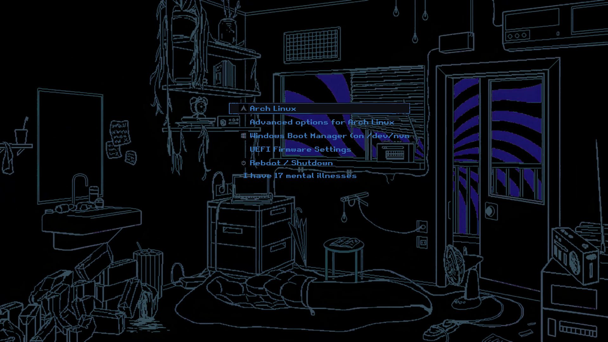

# 🥛 Milk Outside A Bag Of Milk Grub BLUE Theme



### Why does this fork exist?

Simply because I like the colour blue and I wanted it to match my desktop color.

### 🛠️ Installation

```bash
git clone https://github.com/gemakfy/MilkGrub
sudo ./MilkGrub/install.sh
```

### ❄ NixOS
```nix
# flake.nix
{
  inputs.milk-grub-theme.url = "github:gemakfy/MilkGrub";

  outputs = { nixpkgs, ... }@inputs: {
    nixosConfigurations.nixos = nixpkgs.lib.nixosSystem {
      modules = [
        # ...
        inputs.milk-grub-theme.nixosModule
      ];
    };
  };
}

# configuration.nix
{
  boot.loader.grub = {
    enable = true;
    gfxmodeEfi = "1920x1080"; # set your resolution
    gfxpayloadEfi = "keep";
    milk-theme.enable = true;
  };
}
```

## O!
Code reference: https://github.com/uiriansan/LainGrubTheme
